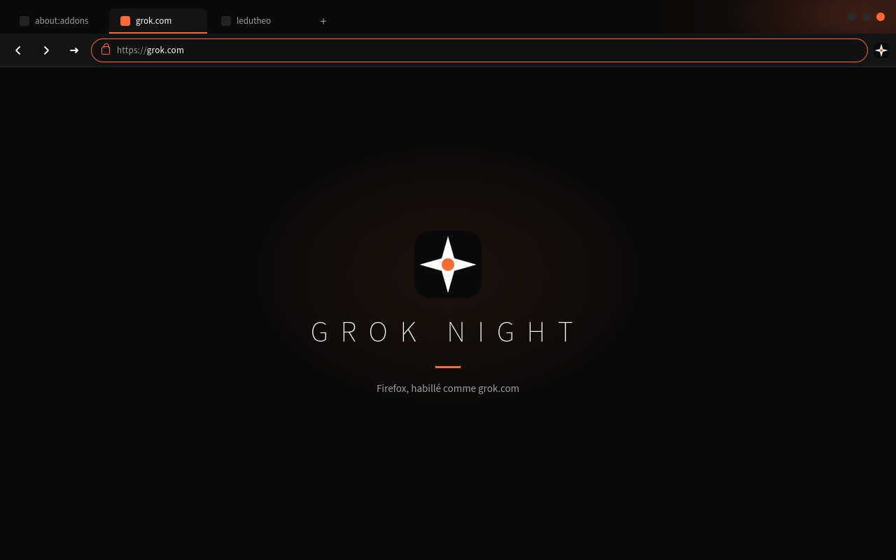

<p align="center">
  
</p>

<h1 align="center">GROK NIGHT</h1>

<p align="center">
  Firefox, habillé comme <a href="https://grok.com">grok.com</a>.<br>
  Void. Blanc. Une étincelle orange.
</p>

<p align="center">
  
</p>

<p align="center">
  <em>Unofficial. Not an xAI product. Original mark — not their logo.</em>
</p>

## Installer

Firefox Release n’installe un thème **en permanent** que s’il est signé par Mozilla.

**Maintenant, en local :**

1. `about:debugging#/runtime/this-firefox`
2. **Charger un module temporaire**
3. `theme/manifest.json`

```bash
git clone git@github.com:ledutheo/firefox-theme-grok.git
cd firefox-theme-grok
# about:debugging → theme/manifest.json
```

**Permanent :** soumettre `dist/grok-night.xpi` (via `./scripts/build.sh`) sur [addons.mozilla.org](https://addons.mozilla.org/developers/). Copier-coller : [`amo/listing.md`](amo/listing.md).

English: same three clicks in `about:debugging`, then pick `theme/manifest.json`.

## Ce que tu vois

| | |
|---|---|
| Chrome | `#0A0A0A` void, `#141414` barres |
| Texte | `#FCFCFC` / `#9E9E9E` |
| Accent | `#FF6B35` — onglet actif, focus urlbar, icônes « attention » |
| Pages web | intouchées (`content_color_scheme: auto`) |
| about: / chrome Firefox | sombres (`color_scheme: dark`) |

Le header n’est **pas** un sticker « GROK NIGHT » sur chaque fenêtre. Étoiles, halo, petite marque à droite. grok.com est du silence ; le chrome aussi.

## Ce que le format permet vraiment

Un thème statique **s’arrête aux couleurs et aux images**. Dès que `"theme"` est dans le manifest, Firefox ignore scripts et permissions.

Ici, le paquet utilise tout le schéma officiel (`theme.json`, Firefox 154) : 39 couleurs, `theme_frame`, `dark_theme`, `gecko` + `gecko_android`, i18n fr/en. Chaque clé est commentée dans [`theme/manifest.json`](theme/manifest.json).

Au-dessus, dans [`beyond/`](beyond/) — pas dans le XPI listé :

1. `browser.theme.update()` — jour / nuit à l’horloge  
2. `theme_experiment` — Nightly, n’importe quel sélecteur chrome  
3. `userChrome.css` — un profil, hors AMO  
4. Fennec — `gecko_android` pour AMO ; le chrome Fenix ne repeint presque rien

## English

Unofficial Firefox theme in grok.com colors: black chrome, white type, orange spark. Load `theme/manifest.json` from `about:debugging`. Not an xAI product.

## Licence

MIT · [ledutheo](https://github.com/ledutheo) · [preview](https://ledutheo.github.io/firefox-theme-grok/)
